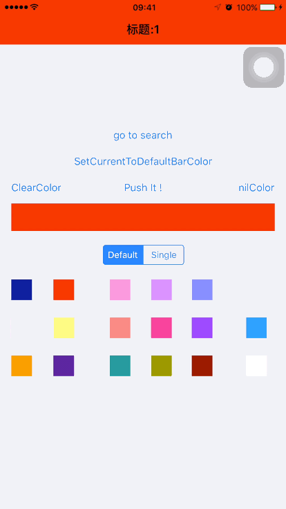

# NJNavigationBar
-
change the bar color of NavigationBar when push or pop

1. 参考支付宝的navigationBar效果，在push和pop时 颜色渐变，并跟随手势变换
2. 参考网易云音乐的navigationBar效果，每个vc单独一个navigationBar

#### 已知问题
barStyle 为 `NJNavigationBarStyleSingle`时，由于是直接盖一个view到当前vc上，所以vc的`edgesForExtendedLayout`属性相当于一直包含`UIRectEdgeTop`的状态。`NJNavigationBarStyleDefault`无此问题。

